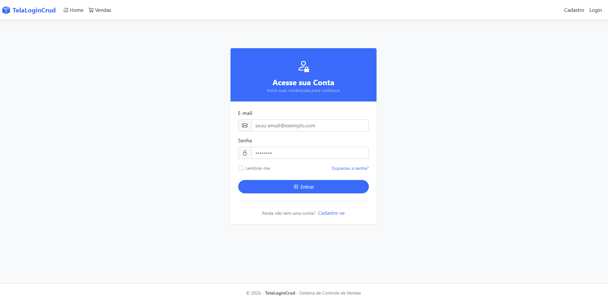

# 🛒 TelaLoginCrud

Sistema desenvolvido em **ASP.NET Core MVC** utilizando a linguagem **C#** e o padrão arquitetural **Model-View-Controller (MVC)**.

O projeto tem como objetivo demonstrar a implementação de um sistema CRUD (Create, Read, Update e Delete) para gerenciamento de vendas e controle de acesso com autenticação de usuários (ASP.NET Core Identity), utilizando boas práticas de desenvolvimento, persistência de dados com Entity Framework Core e interface responsiva com Bootstrap.

---

## 📋 Tecnologias Utilizadas

* C#
* .NET
* ASP.NET Core MVC
* ASP.NET Core Identity (Autenticação e Autorização)
* SQL Server
* Entity Framework Core
* Bootstrap 5
* jQuery

---

## 📦 Pacotes Utilizados

O projeto utiliza os seguintes pacotes do Entity Framework Core:

* Microsoft.EntityFrameworkCore
* Microsoft.EntityFrameworkCore.SqlServer
* Microsoft.EntityFrameworkCore.Tools
* Microsoft.EntityFrameworkCore.Design
* Microsoft.VisualStudio.Web.CodeGeneration.Design

---

## 🗄 Banco de Dados

O banco de dados foi desenvolvido utilizando o **SQL Server**.

A criação da estrutura do banco foi realizada através da abordagem **Code First**, utilizando **Migrations** do Entity Framework Core.

---

# 🚀 Funcionalidades

* Autenticação de Usuários (Login, Cadastro e Gerenciamento de Sessão)
* Cadastro de Vendas
* Alteração de registros de vendas
* Exclusão de registros
* Consulta de dados com formatação financeira e datas
* Cálculo automático de totais (Quantidade total e Valor financeiro total)
* Interface responsiva com suporte a Bootstrap Icons

---

## 🎨 Interface

A interface foi desenvolvida utilizando:

* Bootstrap 5
* Bootstrap Icons
* Razor Views
* jQuery

---

# 📷 Telas do Sistema

## Tela de Login (Acesse sua Conta)



## Tela de Cadastro de Usuário (Criar Nova Conta)


## Painel de Vendas (Listagem)

---

## Cadastrar Nova Venda

---

# ▶️ Como Executar o Projeto

## Clone o repositório

```bash
git clone https://github.com/joaomorata/TelaLoginCrud.git

```

## Abra a solução

Abra o projeto utilizando o **Visual Studio 2022**.

## Configure a conexão

Edite o arquivo:

```json
appsettings.json

```

Configurando a string de conexão para a sua instância do SQL Server.

## Execute as Migrations

No Console do Gerenciador de Pacotes execute:

```powershell
Update-Database

```

Ou utilize o .NET CLI:

```bash
dotnet ef database update

```

## Execute o projeto

Pressione **F5** ou clique em **Iniciar** no Visual Studio.

---

# 📂 Estrutura do Projeto

```text
TelaLoginCrud
│
├── Areas
│   └── Identity
├── Controllers
│   ├── HomeController.cs
│   └── VendaController.cs
├── Migrations
├── Models
│   ├── ErrorViewModel.cs
│   └── Venda.cs
├── Views
│   ├── Home
│   │   ├── Index.cshtml
│   │   └── Privacy.cshtml
│   ├── Shared
│   │   ├── _Layout.cshtml
│   │   ├── _LoginPartial.cshtml
│   │   ├── _ValidationScriptsPartial.cshtml
│   │   └── Error.cshtml
│   └── Venda
│       ├── Create.cshtml
│       ├── Delete.cshtml
│       ├── Details.cshtml
│       ├── Edit.cshtml
│       └── Index.cshtml
├── wwwroot
│   ├── css
│   │   └── site.css
│   ├── js
│   └── lib
├── appsettings.json
└── Program.cs

```

---

# 💻 Desenvolvido com

* ASP.NET Core MVC
* C#
* SQL Server
* Entity Framework Core
* ASP.NET Core Identity
* Bootstrap 5

---

# 👨‍💻 Autores

### Desenvolvedor

**João Pedro Rabelo Schoettner Morata**

### Professor

**Wallace Oliveira dos Santos**
